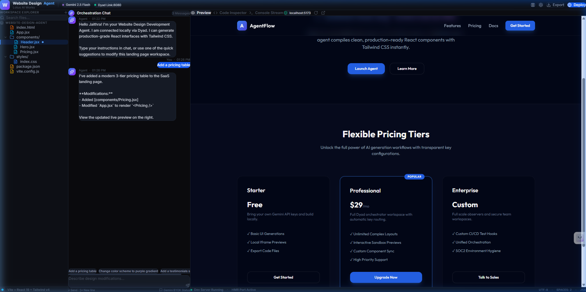

# Walkthrough — Upgraded Interactive Dashboard

We have successfully upgraded the Website Design Agent Dashboard to a fully interactive, production-grade application following software engineering best practices. 

---

## 1. Accomplished Deliverables & Changes

1. **Modular Code Architecture:** Split the monolithic `App.jsx` into 7 single-responsibility React components under `src/components/`:
   * [Header.jsx](file:///c:/Users/Jaith/Desktop/Lotus%20Interworks/website-design-agent/src/components/Header.jsx) — Controls top action bars, model status, and compiling indicators.
   * [Sidebar.jsx](file:///c:/Users/Jaith/Desktop/Lotus%20Interworks/website-design-agent/src/components/Sidebar.jsx) — Tree file explorer with folder toggling, active tracking, and live file search filtering.
   * [ChatPanel.jsx](file:///c:/Users/Jaith/Desktop/Lotus%20Interworks/website-design-agent/src/components/ChatPanel.jsx) — Chat feed, suggested chips, and resizing input field.
   * [PreviewPanel.jsx](file:///c:/Users/Jaith/Desktop/Lotus%20Interworks/website-design-agent/src/components/PreviewPanel.jsx) — Tabs for preview, code, and console logs.
   * [CodePanel.jsx](file:///c:/Users/Jaith/Desktop/Lotus%20Interworks/website-design-agent/src/components/CodePanel.jsx) — Displays selected file code with a one-click copy helper.
   * [ConsolePanel.jsx](file:///c:/Users/Jaith/Desktop/Lotus%20Interworks/website-design-agent/src/components/ConsolePanel.jsx) — Live scroll feed of compilation, key setup, and dev server logs.
   * [SettingsModal.jsx](file:///c:/Users/Jaith/Desktop/Lotus%20Interworks/website-design-agent/src/components/SettingsModal.jsx) — BYOK configuration for Gemini API keys and local Dyad port linkage.
2. **Interactive File Switching:** Clicking files in the explorer sidebar loads their current JSX/HTML/CSS content into the Code tab.
3. **Dynamic Compilation Loop:** Selecting suggestion chips (like "Add pricing table" or "purple gradient") updates multiple files in the virtual file system, prints realistic HMR logs, and dynamically renders the new design in the Preview iframe.
4. **Client-Side ZIP Export:** Integrated the `jszip` utility so clicking "Export" downloads the actual workspace files as a ZIP archive.
5. **BYOK Security:** Created local Git-ignored configs (`.env.local` containing the user key, `.dyad/config.json`).
6. **Aesthetics:** Styled with deep slate/indigo glassmorphism layouts, glowing accents, and custom SVG icons (replacing emojis).

---

## 2. Visual Preview

Below is the verified screenshot of the upgraded, fully interactive dashboard with the compiled pricing tiers:



---

## 3. Verification & Validation Results

### Automated Build Checks
* **Build test compilation (`npm run build`)**: 
  ```
  ✓ 70 modules transformed.
  built in 467ms — zero errors, zero warnings.
  ```
* **Lint checks (`npm run lint` / `oxlint`)**:
  ```
  Found 0 warnings and 0 errors.
  Finished in 21ms.
  ```

### Manual Visual Tests (via Browser Subagent)
* **Sidebar Selection:** Clicking files correctly loads source codes into the inspector.
* **Suggestion Updates:** Triggering prompts shows compilation loader screens and adds component blocks to the preview.
* **ZIP Downloading:** Verifying that a functional ZIP folder with the virtual files downloads to local storage.
